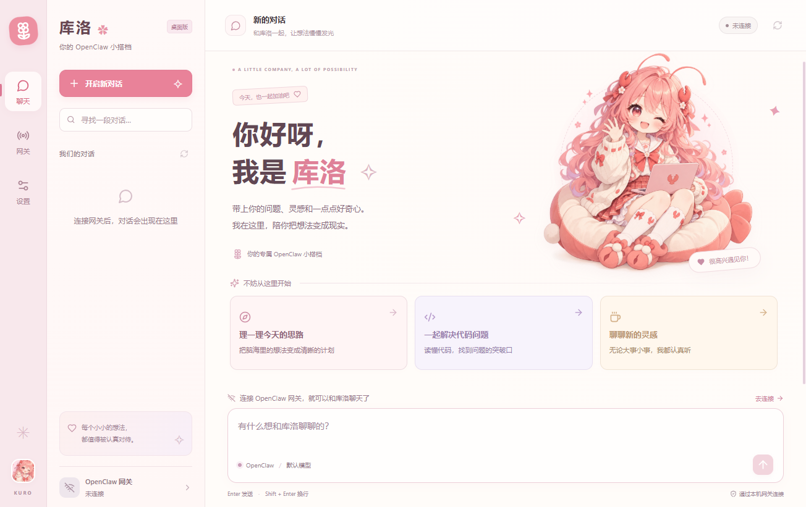
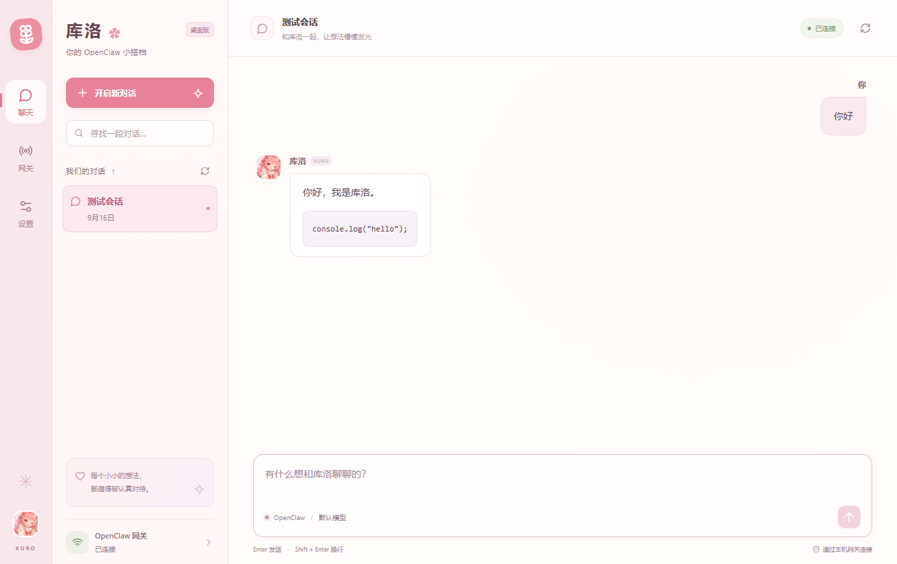
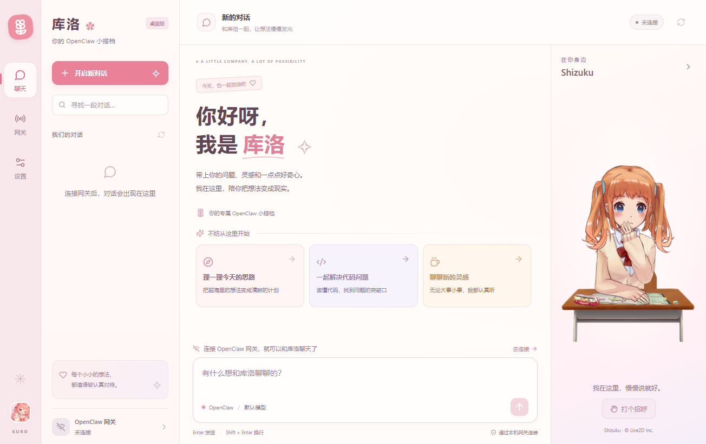
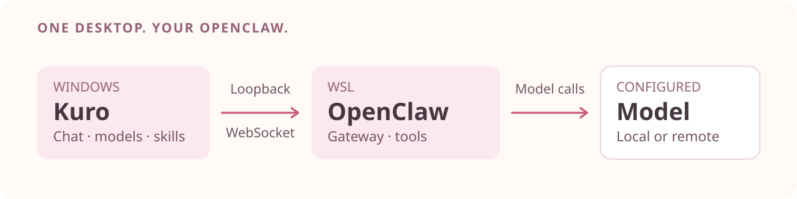

<p align="center">
  
</p>

<p align="center"><strong>简体中文</strong> · <a href="README.en.md">English</a></p>

# 库洛 · OpenClaw 桌面工作台

在 Windows 上，用一个独立窗口连接本机 OpenClaw：继续对话、阅读流式回复、切换模型，查看 Skills 与插件。樱花粉与暖白色的界面，还有可以收起的 Live2D 角色陪伴。

**适合已经部署 OpenClaw、希望在 Windows 上使用桌面界面的用户。** 库洛连接现有网关；首次使用前，需要自行安装 OpenClaw 并启动网关。

[快速开始](#快速开始) · [功能一览](#功能一览) · [连接与认证](#连接与认证) · [开发与构建](#开发与构建) · [常见问题](#常见问题)



<details>
<summary>查看更多界面：聊天与 Live2D 陪伴</summary>

**聊天与代码块**



**可收起的 Live2D 陪伴区**



</details>

*以上为仓库已有界面截图；聊天演示来自本地模拟网关，不是真实模型回复。当前源码还包含 Skills、模型和插件管理页面，界面以运行版本为准。欢迎页库洛插画与 Shizuku 动态角色为不同素材。*

## 功能一览

| 你想做什么 | 库洛提供什么 |
| --- | --- |
| 继续一段对话 | 新建、搜索和切换会话；各会话保留独立草稿与运行状态。 |
| 阅读模型回复 | 流式文字、Markdown、表格、代码块，以及网关提供的工具活动提示。 |
| 选择模型 | 为当前对话切换模型，配置默认模型、服务地址与模型列表。 |
| 查看可用能力 | 浏览与筛选 Skills，查看来源、可用状态和缺失依赖。 |
| 管理插件 | 查看当前 WSL 环境插件、导入插件，并按需重启网关。 |
| 少填一些连接信息 | 从 WSL 导入网关地址与认证，或在设置中手动填写。 |
| 有个桌面小伙伴 | Shizuku 待机、眨眼、呼吸、视线跟随与打招呼；陪伴区可收起。 |

Skills、模型和插件页面需要连接网关；模型配置写入取决于网关权限，插件管理还要求匹配的 WSL 服务环境。角色资源随程序打包，可离线显示；模型是否需要联网由 OpenClaw 的模型配置决定。

## 快速开始

### 1. 准备本机网关

确认 OpenClaw 网关已经运行，且 Windows 能访问其本机端口。默认地址是 `ws://127.0.0.1:18789/`，自动导入默认使用 WSL 发行版 `Ubuntu-24.04`。

**当前仅支持本机回环地址**：`localhost`、`127.0.0.1`、`[::1]`，不支持直接填写远程服务器地址。

### 2. 启动库洛

**从源码开始**（Windows x64、Node.js 22+、npm）：

```powershell
npm install
npm start
```

`npm start` 会检查 TypeScript、构建并打开 Electron 桌面窗口。首次安装需要下载 Electron 等依赖；单独在浏览器打开 Vite 页面不具备桌面桥接能力。

**已有本地构建产物**：双击 `release/Kuro-0.1.0-Windows-x64.exe` 运行便携版，或双击项目根目录的 `Start-Kuro.cmd`。启动脚本优先打开目录版，其次便携版，没有产物时回退到 `npm start`（需先安装依赖）。构建方式见[开发与构建](#开发与构建)。

### 3. 连接并开始聊天

1. 首次启动且没有明确保存过连接配置时，应用尝试从默认 WSL 发行版导入并连接；WSL 导入需要发行版内安装 Python 3。
2. 导入失败时，进入 **设置**，填写实际发行版名称，点击 **从 WSL 导入**；也可手动填写地址与认证。保存后在 **网关** 页点击 **连接网关**。
3. 看到 **已连接** 后，点击 **开启新对话**，或从侧栏继续已有会话。

不确定发行版名称时，在 PowerShell 中运行：

```powershell
wsl --list --quiet
```

## 连接与认证

<p align="center">
  
</p>

库洛负责桌面交互，OpenClaw 负责会话、工具和模型调用。上图展示常见 WSL 部署方式：**桌面客户端 → 本机网关 → 配置的模型服务**。本机连接限制不代表模型推理一定在本地执行。

- **自动导入**：读取 WSL 中的 OpenClaw 配置，默认路径为 `~/.openclaw/openclaw.json`，也考虑 `OPENCLAW_CONFIG_PATH` 和网关服务环境中的认证信息。
- **认证方式**：WSL 导入支持 Token、Password 和无认证配置；手动填写时选择 Token 或 Password。密码首尾空格会原样保留。
- **凭据存储**：连接配置和设备身份保存在 Electron `userData` 下的 `connection.sealed`，通过 `safeStorage` 使用 Windows 系统能力加密。已保存的秘密不会在界面回显；应用不持久化本地聊天消息缓存。

<details>
<summary>更换连接、保存凭据与便携版的注意事项</summary>

- 手动保存或导入后，后续启动使用已保存配置；无认证配置也会保留。
- 地址和发行版不变时，凭据留空可保留已有认证；更换任一项会清除旧认证，需要重新导入或填写。
- 保存设置或重新导入会断开网关，并清空会话视图和未发送草稿。重连后从对应网关重新加载记录。
- 保存成功后凭据输入框清空。请使用原来的 Windows 账户运行应用，以读取加密配置。
- “便携版”指程序免安装；连接设置仍在当前用户的应用数据目录中，不会随 EXE 移动。

</details>

## 日常使用与边界

- **发送消息**：`Enter` 发送，`Shift + Enter` 换行；输入法组合输入期间回车不会发送。欢迎页建议卡只填入草稿，由你确认发送。
- **浏览历史**：会话列表最多读取 100 条，每个会话显示最近 200 条历史消息；可以刷新列表和聊天记录，生成期间也能切换会话。
- **内容显示**：支持 Markdown、列表、表格和代码块；HTTP/HTTPS 链接通过系统浏览器打开。历史图片显示文字占位，暂不支持上传附件。
- **停止与断线**：停止请求需要网关确认。连接中断或发送结果不确定时，先重连并刷新记录，确认消息是否送达，再决定是否重试。
- **角色陪伴**：点击角色或“打个招呼”播放互动动作；收起状态会记住，收起或离开聊天页会释放渲染资源。图形功能不可用时仍可聊天，系统启用“减少动态效果”时静态展示。
- **当前范围**：尚未接入语音或专用情绪表情；默认构建未做 Windows 代码签名，也没有自动更新流程。

## 开发与构建

技术栈：**Electron · React · TypeScript · Vite**；角色使用 **PixiJS · pixi-live2d-display**。

```powershell
# 检查类型并构建前端、Electron 主进程
npm run build

# 生成可直接运行的目录版
npm run package:dir

# 生成 Windows x64 便携 EXE
npm run package
```

产物位于 `release/win-unpacked/Kuro.exe` 和 `release/Kuro-<版本号>-Windows-x64.exe`，版本号来自 `package.json`。目录版分发时需要保留整个 `win-unpacked` 目录。打包器可能下载 Windows 打包工具；打包命令禁用发布，不包含 WSL 配置或用户凭据。

验证命令：

```powershell
npm test
npm run test:desktop
npm run test:live2d
```

桌面与 Live2D 检查前先运行 `npm run build`。自动测试和模拟网关不能替代真实模型联调；历史验证范围见[验收记录](docs/verification-notes.md)与 [Live2D 验证记录](docs/work/2026-09-24-live2d.md)，其中的测试数量与产物校验值对应各自记录日期。

## 常见问题

| 情况 | 处理方式 |
| --- | --- |
| 找不到 WSL 配置 | 检查发行版名称、Python 3 和配置路径，再从设置重新导入。 |
| 网关连接失败 | 确认网关运行、端口正确，且 Windows 可以访问本机回环地址。 |
| 导入提示扩展 JSON 不受支持 | 导入器使用标准 JSON 解析；可改为手动填写地址及 Token / Password。 |
| 网关要求设备配对 | 使用 OpenClaw 的设备审批流程，然后重新连接。 |
| 模型配置无法保存 | 检查网关权限、配对状态和提示信息；对话生成结束后再保存。 |
| 插件环境不匹配 | 确认所选 WSL 发行版中的 `openclaw-gateway.service` 用户服务与当前连接端口一致。 |
| 无法读取加密配置 | 使用原来的 Windows 账户和正常桌面用户会话启动。 |
| 回复中途断线 | 重连并刷新历史，核实已发送和已生成的内容后再继续。 |

## 授权与素材

当前 `package.json` 标记为 `UNLICENSED`，仓库未提供项目开源许可证。Live2D Shizuku 示例模型与 Cubism 运行库有各自的授权条款，第三方依赖许可也需分别遵守；分发或商用前请查阅 [Live2D 素材与依赖说明](public/live2d/NOTICE.txt)。
